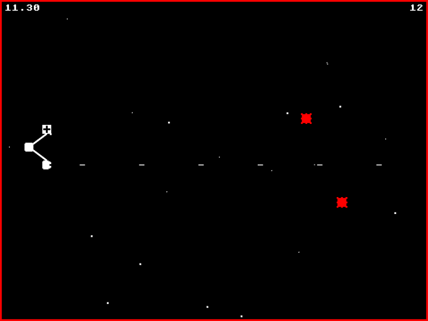

# Triple-Threat
Triple Threat is a JavaScript game, made using [Kaboom.js](https://kaboomjs.com/) made for [GMTK Game Jam 2021](https://itch.io/jam/gmtk-2021). The theme of the Jam was Jointly Connected, and, following that theme, Triple Threat is an arcade style shooter game where the player space ship is composed of three distinct parts. Fight through endless waves of alien attackers and attain the highest possible score!

The game is available to play, for free, in your browser at: https://swilliamsio.itch.io/triple-threat

